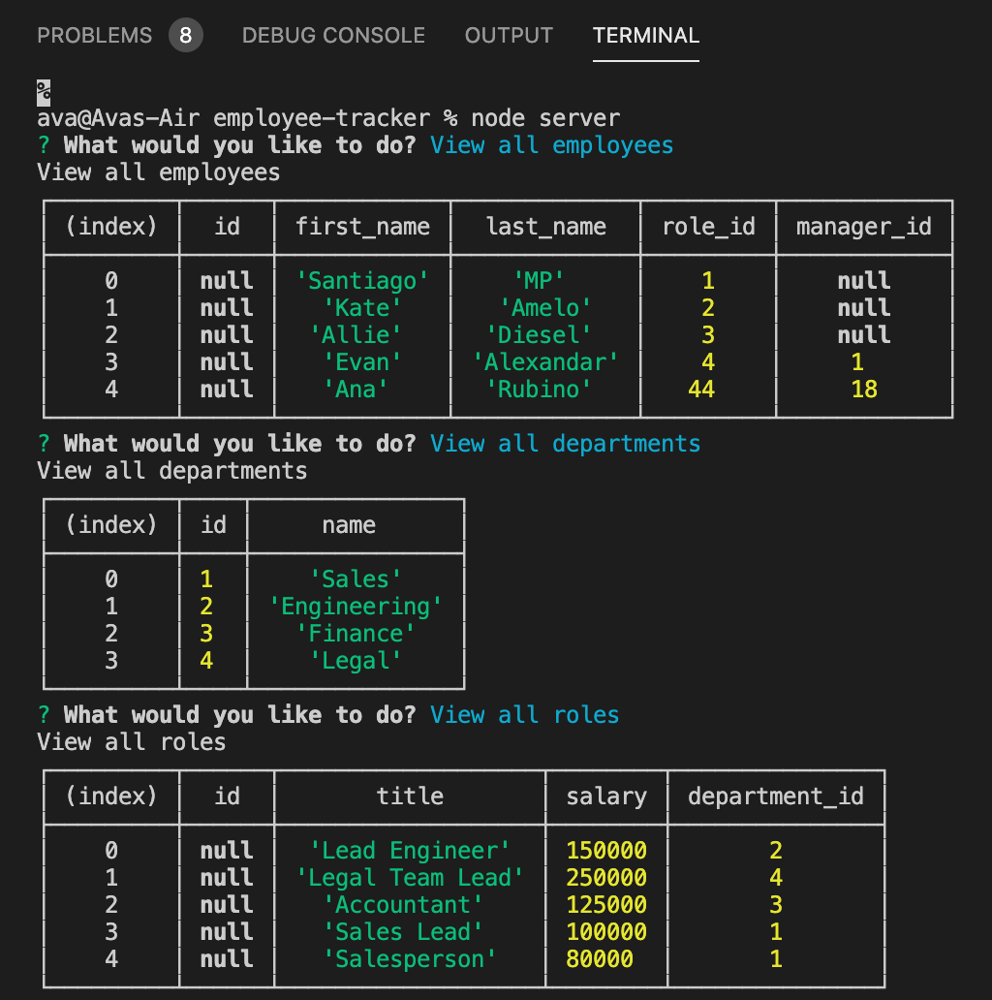
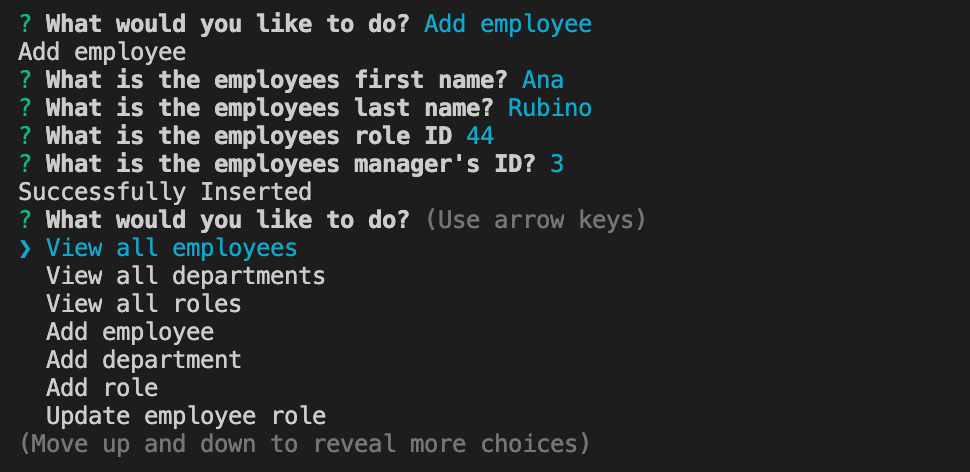

# Employee Breakdown Dashboard

## Description
In this app, you will be able to input information about team members so the app groups them in a clear and concise way. The user will be able to view the team by department, role, or see a list of all employees.

## Created Using
JavaScript

JSON

Node

MySQL

Inquirer

Heroku

## Images

## Video

<video controls preload width=500>
<source src="https://github.com/avatl/employee-tracker/blob/main/Assets/employee-tracker.mov/" type="video/quicktime">
</video>

